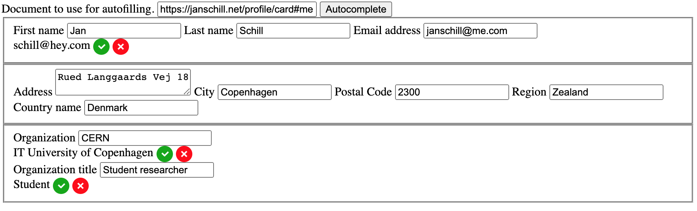

# solid-autocomplete

This module allows an HTML form to be populated with data from your Solid pod. As of now only data from a WebId profile document is supported. This is also part of a proof of concept programming, which aims at working with an existing software system called [Indico](https://github.com/indico/indico).

## Development

1. Clone the repository

```bash
$ git clone git@github.com:janschill/solid-autocomplete.git
$ cd solid-autocomplete
```

2. Install dependencies

```bash
$ npm ci
```

3. Run webpack development server

```bash
$ npm start
```

4. Copy `index.html` into `dist/` directory

```bash
$ cp src/index.html dist/index.html
```

## Usage

1. Install Solid Autcomplete

```bash
npm i solid-autocomplete
```

2. Import the library into your project

```js
// const SolidAutocomplete = require("solid-autocomplete")
import SolidAutocomplete from "solid-autocomplete"
```

3. Configuration

* `form`: A form where it shall fill in the inputs. If this is not given it will naively grab the first it finds.
* `button`: A button can be passed in that when pressed will trigger the autocomplete functionality.
* `createAutocompleteDomControls()`: Helper method can create the button and input field for the WebId URL can be automatically generated

```js
const solidAutocomplete = new SolidAutocomplete({ form, button })
// solidAutocomplete.createAutocompleteDomControls()
solidAutocomplete.setupSolidAutocomplete()
```

### Indico

1. Install solid-autocomplete in Indico

```bash
npm i solid-autocomplete
```

2. Configure MutationObserver and Solid Autocomplete

TODO: Explain

```js
// indico/modules/events/registration/client/js/solid.js
import SolidAutocomplete from 'solid-autocomplete';

function observeFormCreation() {
  const formId = 'registrationForm';
  const $conferencePage = document.querySelector('.conference-page');
  const targetNode = $conferencePage;
  const config = {attributes: false, childList: true, subtree: true};

  const callback = (mutationsList, observer) => {
    for (const mutation of mutationsList) {
      if (mutation.type === 'childList') {
        for (const node of mutation.addedNodes) {
          if (node.id === formId) {
            observer.disconnect();
            const solidAutocomplete = new SolidAutocomplete({form: node});
            solidAutocomplete.createAutocompleteDomControls(node);
            solidAutocomplete.setupSolidAutocomplete();
          }
        }
      }
    }
  };

  const observer = new MutationObserver(callback);
  observer.observe(targetNode, config);
}

document.addEventListener('DOMContentLoaded', async () => {
  observeFormCreation();
});
```

3. Import script in event registration index

```js
// indico/modules/events/registration/client/js/index.js
import './solid'
```

## How Does the Library Work?

An input field is generated which will be used to fetch the WebId profile document. It also requires a base element, ideally the form with the input fields is given here. It then grabs all `<input>` and `textarea>` fields.
Then the fields are mapped to available data in the fetched document and automatically filled in, if the inputs do not have any values. If the inputs have values prior to automatic filling, a DOM element is rendered which gives the user the option to either accept the new data or reject it and keep the filled in data.

## How Are the Inputs Mapped to the Fetched Data?

HTML input fields carry a few attributes which can be used to identify what type of data it is describing.

### Autocomplete

The first attribute, which is also used by the browser to suggest possible data to the user for the inputs is the `autocomplete` attribute. The HTML specification defines exactly what values need to be used for what type of data [[Source]](https://html.spec.whatwg.org/multipage/form-control-infrastructure.html#autofill).
If the `autocomplete` attribute exists on the inputs it is checked for any useful values and then looked up in the [dictionary](#dictionary) to mapped against the fetched data.

### ID

TODO: explain

### Name

TODO: explain

### Label

If all the above mentioned approaches do not yield good results the last option is the label tag. The label tag should exist per HTML specification for every input. It can be easily found by following the `id` attribute of the input, as every `label` should also have a `for` attribute, which links the `label` and `input` together.

```html
<label for="my-text-input">My text input</label>
<input id="my-text-input" type="text">
```

The value or `textContent` of a label describes what the user should provide in the linked `input` field. Unfortunately, to reason about the content of the label is not trivial, as it does not follow any conventions and can be in any language.

## Dictionary

The dictionary is a simple key value store that maps possible entries for the above mentioned attributes against the VCARD vocabulary.

## Preview

An example form showing conflicting data.



## What Fields Can Be Detected?

Only fields that can be *autocompleted* by the browser are:

- `<input>`
- `<textarea>`
- `<select>`

Additionally it needs

1. Have a name and/or id attribute
2. Be descendants of a <form> element
3. The form to have a submit button

### Valid Fields

HTML autocomplete form inputs:

| ID | Description |
| -  | -           |
| name | “The field expects the value to be a person's full name. Using "name" rather than breaking the name down into its components is generally preferred” |
| email | Email address |

*For a complete list see link [[2]](https://html.spec.whatwg.org/multipage/form-control-infrastructure.html#autofill).*

## Features

1. Authenticate to Solid Pod
2. Fetch data from pod
    - From WebID profile document
    - From other resources?
3. Put data into form inputs
    - Check for already filled in data, and ask for what to keep
    - Have checkbox to remember data? Save data in pod and use next time

## Indico Example Fields

- Title
- First Name
- Last Name
- Email Address
- Affiliation
- Institutional Address
- Country

## Useful Links

- [1] https://developer.mozilla.org/en-US/docs/Web/HTML/Attributes/autocomplete
- [2] https://html.spec.whatwg.org/multipage/form-control-infrastructure.html#autofill
